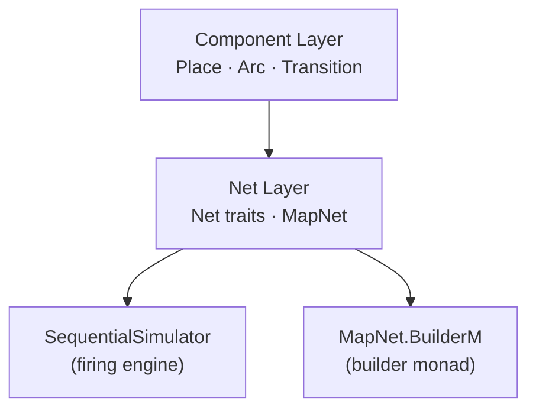
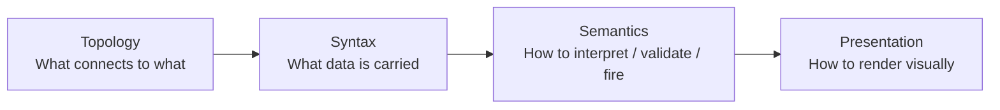
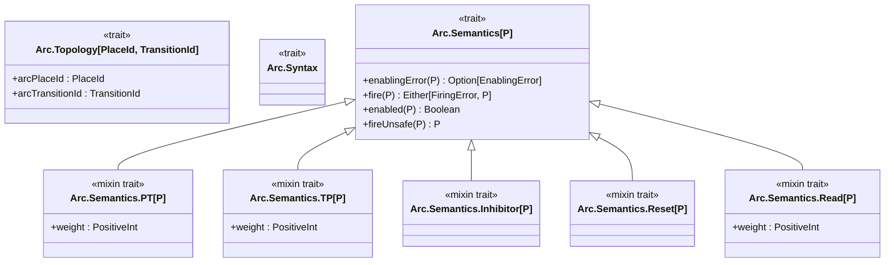
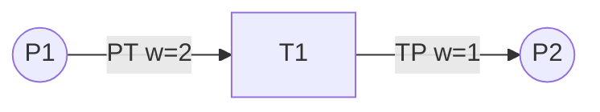
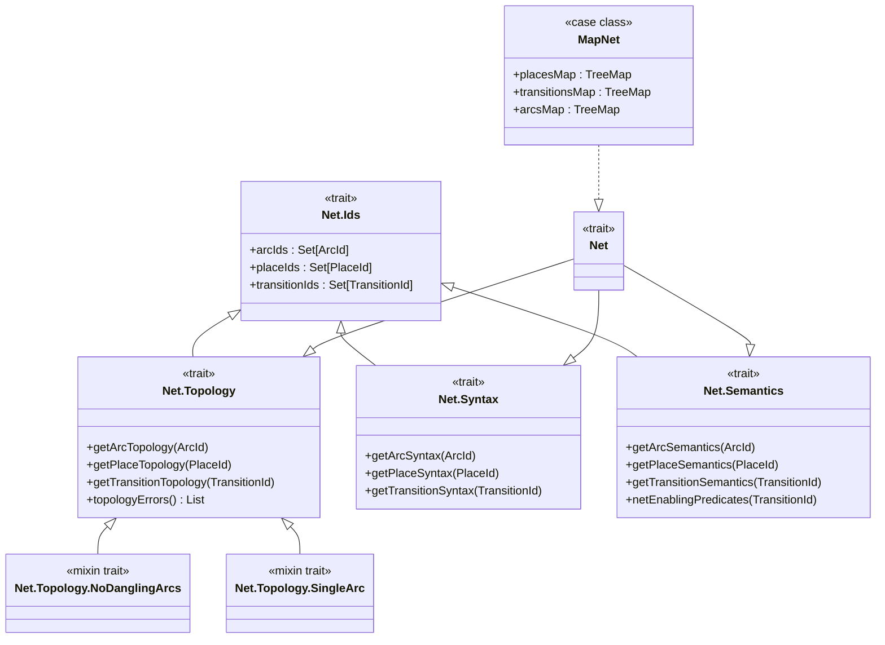
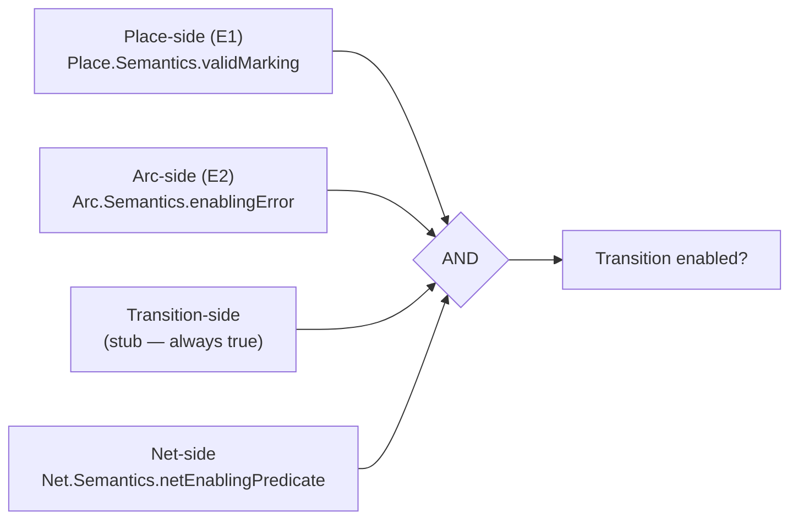
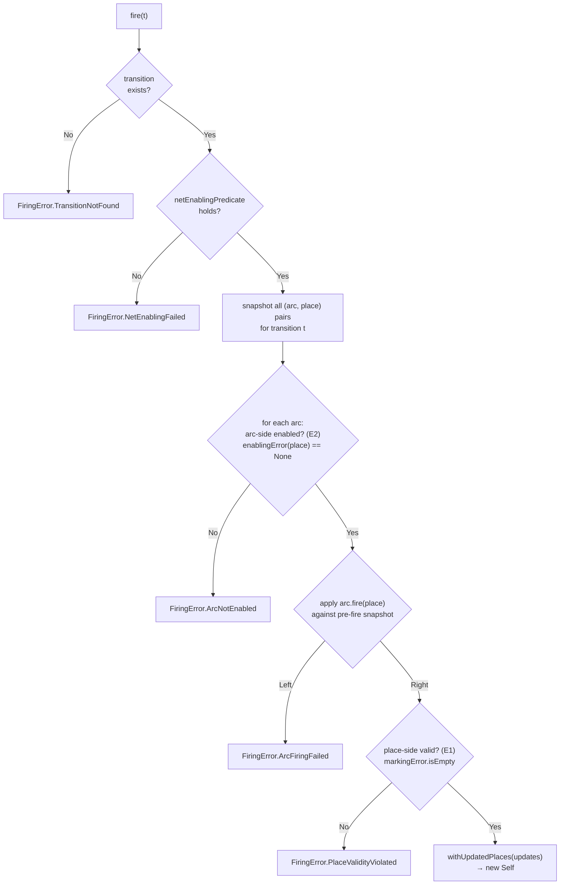
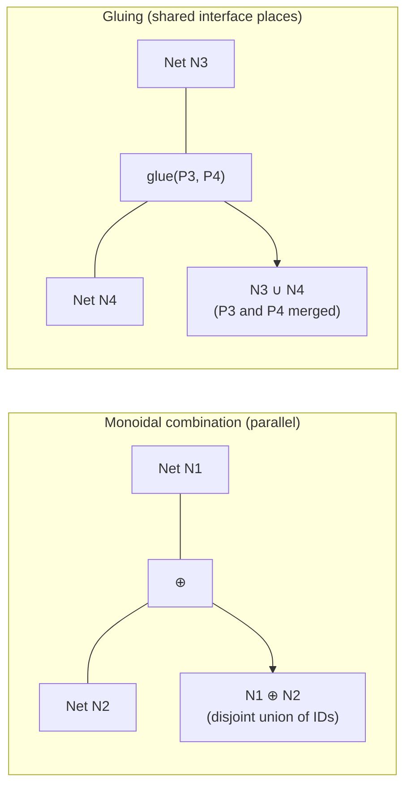

# Petri Net Library

A typed, extensible Petri net library for Scala 3, used internally to model the Hydrozoa protocol.
The library is designed around four separable concerns (topology, syntax, semantics, presentation)
and exposes a functional builder monad for constructing nets.

---

## Motivations

The _description_ of a Petri net must be done imperatively. At the very least, there is a temporal
ordering to contend with — arcs and nodes have to be declared in some sequence; the whole net cannot
come into existence at once.

### Properties of Nets

#### Topologies

Nets have _topologies_: at minimum, transitions, places, and arcs between them. Certain topology
representations support type-safe encoding, such as adjacency matrices or tensors (for arcs with
multiplicity).

Other representations, such as `Map[ArcId, (PlaceId, TransitionId)]`, may be more straightforward
to build, simulate, or display — at the cost of permitting invalid states. An invalid state here is
a "dangling arc", where an `ArcId` points to a `PlaceId` or `TransitionId` that does not exist.
Additionally, a user may unintentionally overwrite a given `ArcId` in the `Map` if the API is
poorly designed or carelessly used.

Convenient representations therefore require _soundness validation_.

There are also different restrictions or extensions that can be applied to net topology. For example:
can there be more than one arc between a given place and transition? If so, how is that collection
represented — ordered or unordered?

#### Semantics

Nets also have semantics. These decompose into _enabling semantics_, which determine whether a given
transition is enabled; _firing semantics_, which determine how the net updates when an enabled
transition fires; and _auto-firing semantics_, which determine which of the potentially many enabled
transitions fires at any given time.

For places, semantics might include:
- Token colouring, identity, or net-observable data
- Capacity bounds
- Whether the place contributes to a final marking assessment
- Timed places, where tokens can only be added or removed after certain amounts of time
- Firing semantics such as "mixing functions" for non-fungible tokens in a place

**Enabling Condition E1**: For a transition $t$ to be enabled, it is necessary (but not sufficient)
that a "test" firing updates all connected places $p$ without violating their place semantics.

For arcs, the _enabling semantics_ define a predicate over the attached place $p$ that is a
necessary (but not sufficient) condition for the attached transition $t$ to fire.

- For "regular" arcs (weighted), this includes the direction of token flow and the associated
  weights.
- Arcs with _only_ enabling conditions:
  - Inhibitor arcs (unweighted) — enable only when the place has 0 tokens.
  - Read arcs (weighted) — enable only when `p.tokens >= weight`.
- Reset arcs — drain all tokens from a place (always arc-side enabled).
- Other extensions: timed arcs, stochastic arcs that fire probabilistically or consume variable
  numbers of tokens.

**Enabling Condition E2**: For a transition $t$ to be enabled, it is necessary that for all arcs
$a$ connected to $t$, `a.enablingPredicate(p)` holds.

For arcs, the _firing semantics_ are endomorphisms on the attached places, determining how tokens
are modified when an enabled transition fires.

For transitions, enabling semantics might include timing or stochastic behaviour, and for
data-aware Petri nets, the evaluation of pre-condition and post-condition expressions.

Finally, nets as a whole sometimes must make meaningful semantic choices when the topology permits
multiple arcs between the same place $p$ and transition $t$: must enabling predicates hold
throughout the firing of multiple arcs, or only at the endpoints? In what order are non-commutative
endomorphisms applied? Can transitions fire genuinely in parallel, or must firings be serialised?

#### Instantiation (a.k.a. "Marking")

Even after setting topology and semantics, data still needs to be applied to the net. For places,
this is setting the tokens (including quantity, colour, data, etc.). For transitions in data-aware
Petri nets, this includes assigning pre/post-condition expressions.

Whether a given instantiation is _valid_ depends on the semantics — a place with a maximum capacity
of 5 must have between 0 and 5 tokens. Outside of dependently typed languages, enforcing this at
construction time is non-trivial. There is therefore a notion of whether a given marking _satisfies_
a given semantics.

#### Presentation

In addition to the above, there is presentation-related data: graphical labels and positions for
nodes, and paths for arcs.

### So What Is a Valid Net?

Each property above has a notion of _total coverage_ — does every arc, place, or transition have an
associated topology, semantics, instantiation, and/or presentation?

For topology and instantiation there is also a notion of _soundness_ — are there dangling arcs? Do
the values assigned to each component obey the semantics of the net?

Depending on the choice of semantics, there may even be _unsatisfiability_ — no possible
instantiation satisfies the semantics — or a deadlock where no transitions are ever fireable.

In the general case — allowing arbitrary semantic extensions — validity is probably undecidable. For
_restricted_ cases, it can likely be proved formally or verified with model-based testing. This
raises the question: if two restricted nets are each known to be total and sound, can they be
combined such that the result is also total and sound? This leads to the planned composition
operators described in [Net Composition](#net-composition) below.

---

## Architecture Overview



- **Component layer** — trait hierarchies for individual places, arcs, and transitions
- **Net layer** — `Net` trait that composes the component traits; `MapNet` is the concrete
  map-backed implementation
- **SequentialSimulator** — firing algorithm mixed into `MapNet`
- **BuilderM** — `IndexedStateT`-based builder monad for constructing nets in for-comprehensions

---

## Ontological Ordering

Every component (and the net as a whole) is defined in four layers, each building on the previous.
This separation ensures that topology, data, behaviour, and rendering are independently addressable.



| Layer        | Place concern                       | Arc concern                     | Transition concern          |
|--------------|-------------------------------------|---------------------------------|-----------------------------|
| Topology     | Arc-connection restrictions (stub)  | `arcPlaceId`, `arcTransitionId` | Arc-connection restrictions |
| Syntax       | `marking`, `mark(newMarking)`       | Weight, inscription             | `silent`, `priority`        |
| Semantics    | `markingError`, `validMarking`      | `enablingError`, `fire`         | Pre/postcondition (planned) |
| Presentation | `label`, `position`, `radius`       | `label`, `points`               | `label`, `width`, `height`  |

---

## Component Layer

### Places


**`UnboundedPlace`** — no capacity limit; `markingError` always returns `None`.

**`BoundedPlace`** — has a `bound: PositiveInt`; constructed via a smart constructor that returns
`Either[TooManyTokens, BoundedPlace]`. `markingError` returns `Some(TooManyTokens)` if
`marking > bound`.

> `Place.Syntax` uses F-bounded polymorphism (`Self <: Syntax[Self]`) so that `mark` returns the
> concrete type, not the trait. Every mixin trait that adds update methods follows the same pattern.

---

### Arcs



#### Arc type reference

| Arc type    | Direction           | Enabled when (E2)      | Effect on place (E1)         |
|-------------|---------------------|------------------------|------------------------------|
| `PT`        | Place → Transition  | `tokens >= weight`     | removes `weight` tokens      |
| `TP`        | Transition → Place  | always                 | adds `weight` tokens         |
| `Inhibitor` | Place → Transition  | `tokens == 0`          | none (enabling only)         |
| `Reset`     | Place → Transition  | always                 | drains all tokens            |
| `Read`      | Place → Transition  | `tokens >= weight`     | none (enabling only)         |

> `Inhibitor` and `Read` only gate enabledness (E2); `Reset` always fires but the place-side
> validity check (E1) still applies to the drained result.

#### Petri net notation



Circles represent **places**; rectangles represent **transitions**. Arc labels show type and weight.
Inhibitor arcs are conventionally drawn with a circle arrowhead; Read arcs with a half-arrow.

---

### Transitions

`Transition` is currently a lightweight stub — semantics (pre/postconditions for data-aware nets)
are not yet implemented.

| Trait                           | Purpose                                           |
|---------------------------------|---------------------------------------------------|
| `Transition.Topology`           | Stub; component-side arc restrictions deferred    |
| `Transition.Syntax.HasSilent`   | Whether this transition appears in event logs     |
| `Transition.Syntax.HasPriority` | Relative priority for auto-firing selection       |
| `Transition.Semantics`          | Stub; guard expressions planned                   |
| `Transition.Presentation`       | `label`, `width`, `height`, `position`, `delay`   |

---

## Net Layer

### Trait hierarchy



**`MapNet`** stores places, transitions, and arcs in `TreeMap`s for deterministic iteration order.
All three type parameters (`ArcId`, `PlaceId`, `TransitionId`) require an `Ordering`.

### Topology validation mixins

| Mixin            | What it checks                                           |
|------------------|----------------------------------------------------------|
| `NoDanglingArcs` | Every arc references a place and transition that exist   |
| `SingleArc`      | At most one arc per `(place, transition)` direction pair |

Both use the abstract-override list-accumulation pattern: `topologyErrors` chains via
`super.topologyErrors`, so multiple mixins compose cleanly.

> **Why `SingleArc`?** Firing endomorphisms do not commute in general (e.g. `PT(1)` then `Reset` ≠
> `Reset` then `PT(1)`). Restricting to one arc per direction makes firing trivially
> order-independent.

---

## Building a Net

`MapNet.BuilderMOps` provides a typed builder monad. Operations fail with a `BuilderError` on ID
conflicts or missing IDs; "force" variants (trailing `_`) silently overwrite instead.

```scala
// Fix the six net type parameters once
val ops = MapNet.BuilderMOps[String, String, String, MyArc, MyPlace, MyTransition]()
import ops.*

val program = for
    _ <- addPlace("p1", UnboundedPlace("input", marking = 2))
    _ <- addPlace("p2", UnboundedPlace("output"))
    _ <- addTransition("t1", myTransition)
    _ <- addArc("a1", PTArc("p1", "t1", weight = 1, label = "consume"))
    _ <- addArc("a2", TPArc("p2", "t1", weight = 1, label = "produce"))
yield ()

val result: Either[BuilderError, (MapNet[...], Unit)] = program.runEmpty
```

The `Monad` instance for `BuilderM` is provided as a `given`, so `traverse`, `sequence`, and other
Cats combinators are available when `import cats.implicits.*` is in scope.

---

## Enabling and Firing

### Enabling conditions compose under AND

Enabling is checked at four independent levels — place-side (E1), arc-side (E2), transition-side,
and net-wide — all composed by conjunction:



Because conjunction is commutative and associative, the order of predicate evaluation is a
performance choice only — it does not affect correctness.

### SequentialSimulator firing algorithm

`SequentialSimulator.fire(t)` is purely functional: it returns `Either[FiringError, Self]` where
`Self` is the new net state with updated place markings.



Key points:
- All arc/place pairs are snapshotted **before** any endo is applied (pre-fire state).
- `Arc.Semantics.fire` does **not** check enabledness or place validity — those are the simulator's
  responsibility.
- `Place.Semantics.validMarking` (E1) checks that the fired result satisfies the place's own
  invariants (e.g. `BoundedPlace` capacity).

---

## Validation Summary

| Check                    | Method                  | When to call                           |
|--------------------------|-------------------------|----------------------------------------|
| No dangling arcs         | `net.isValidTopology`   | After building, before simulating      |
| At most one arc per pair | `net.isValidTopology`   | After building, before simulating      |
| All IDs have syntax      | `net.isValidSyntax`     | Guaranteed by construction in `MapNet` |
| All IDs have semantics   | `net.isValidSemantics`  | Guaranteed by construction in `MapNet` |
| Final marking reached    | `net.isValidTerminal`   | After simulation terminates            |

---

## Net Composition (Planned)

If two total, sound, valid net representations are given, they should be combinable into a
representation that is also total, sound, and valid. Two operators are planned:



- **Monoidal combination** — disjoint union of two nets; each retains ownership of its own
  transitions and arcs. Requires disjoint ID sets.
- **Gluing** — identifies a subset of places from one net with places from another, creating shared
  interface places. After gluing, enabling and firing delegate to whichever sub-net owns the
  transition. Autofiring policy of the composed net is a separate semantic choice.

Places can be glued together when the two nets share a place semantic. The hypothesis is that
semantic combination can be handled generically, though without row types or polymorphic variants
the implementation may become unwieldy.

---

## Design Goals

**(1) Separation of concerns.** The primary goal is to separate the four concerns — topology,
syntax, semantics, and presentation — so that each can be addressed independently. Knowing how
places are connected to transitions should not be necessary in order to discuss how many tokens they
can hold (capacity) or currently do hold (instantiation), and it should certainly not be necessary
to specify their coordinates in a visualiser.

**(2) Polymorphic extensibility at the type level.** A user should be able to specify: "I want
places with only regular TP and PT arcs — no inhibitor arcs, no timed arcs. I want a non-data-aware
net, so transitions carry no semantics. I want at most one arc between any given place and
transition." This should be captured _at the type level_, enabling more refined analysis than ad-hoc
extensibility would permit. This does require that users define, for a given combination of
extensions, the composite semantics and soundness criterion. The library attempts to support this in
a principled way, though whether the current design is expressive enough — or too expressive — is
not yet settled.

**(3) Composability via gluing and monoidal combination (planned).** If nets `N_1` and `N_2` have
semantics `S_1` and `S_2` respectively, it should be possible to _combine those semantics_ as well.
See [Net Composition](#net-composition) above.

**(4) Effectful transitions (planned).** Defining the effects that transitions carry — and the
composite effects that nets and composed nets carry — opens up significant expressive power.

**(5) Functional purity.** All builders — for topology, semantics, instantiation, and presentation
— should be monad transformer stacks (or similar) capable of raising errors and transforming types.
F-bounded polymorphism and `IndexedStateT` over `Either` or `Validated` are the target patterns.

Simulation and analysis tools should also have pure variants. Calling `def fire(tid: TransitionId)`
should not throw by default. Exception-throwing variants should be exposed for performance-sensitive
code.

**(6) Serialisation and visualisation by default.** Every net should be serialisable, as well as
all firing logs. YAPNE is the current serialisation target, but PNML or other formats (TikZ,
Mermaid, etc.) could be supported in the future.

**(7, planned) High-performance simulation and analysis.** Mutable, unsafe variants relying on
direct references should be available to avoid traversing large data structures during state reads
or firings. Incidence matrix/tensor representations enabling fast, parallelisable simulation should
also be supported, along with tooling to translate from convenient representations to performant
ones.

**(8, planned) Concurrent, multiplayer updates.** Nets should be queryable and fireable over an API
by multiple users simultaneously, and editable collaboratively in the style of CRDTs or Excalidraw.
