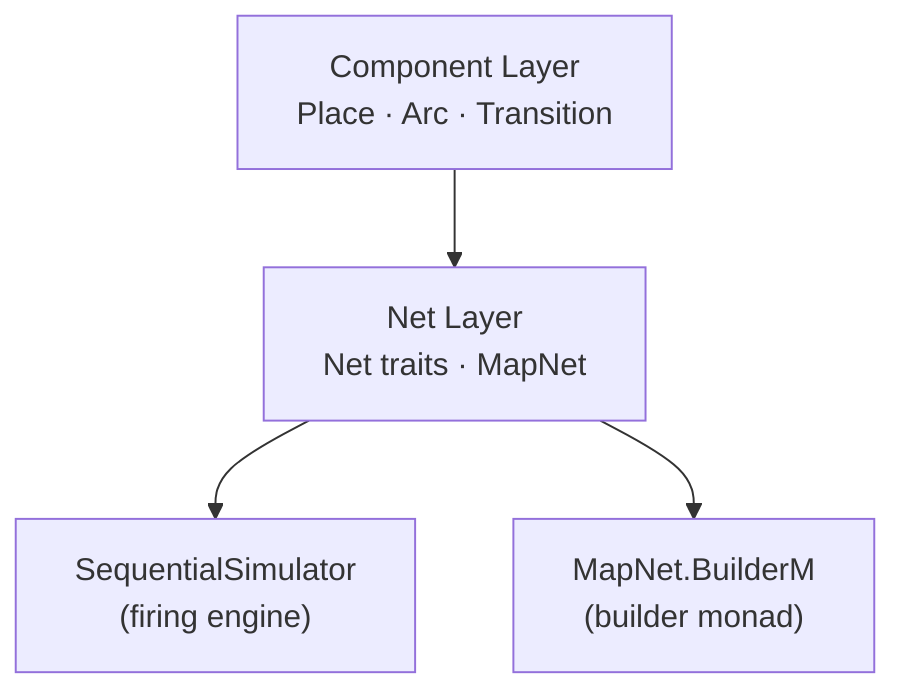
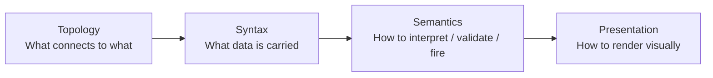
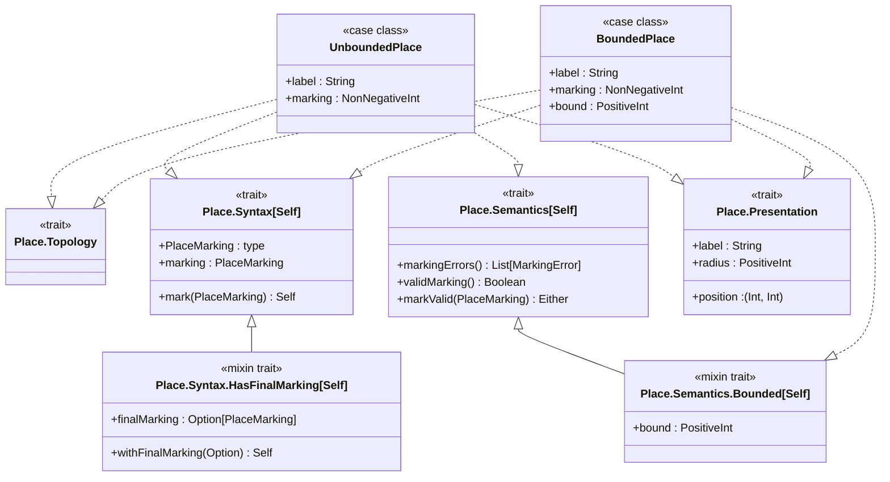
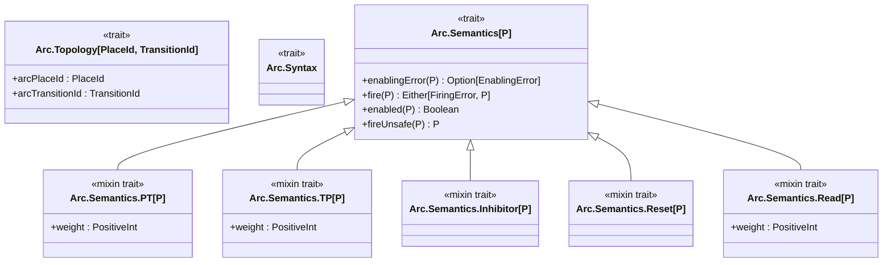
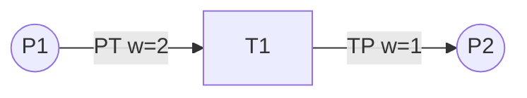
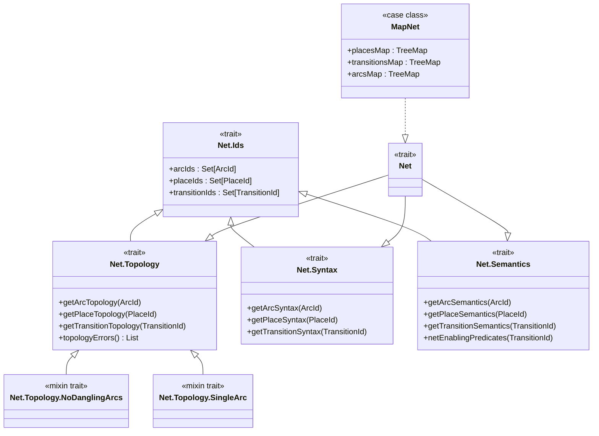
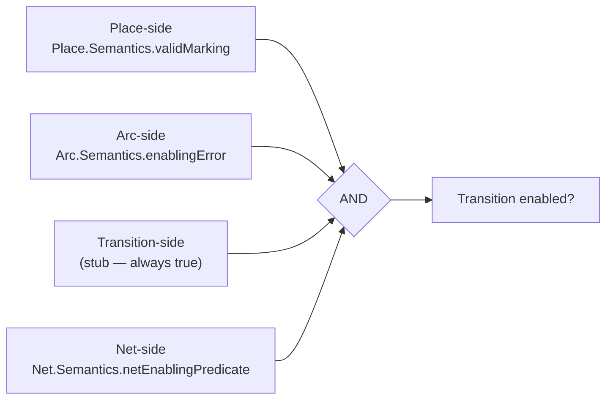
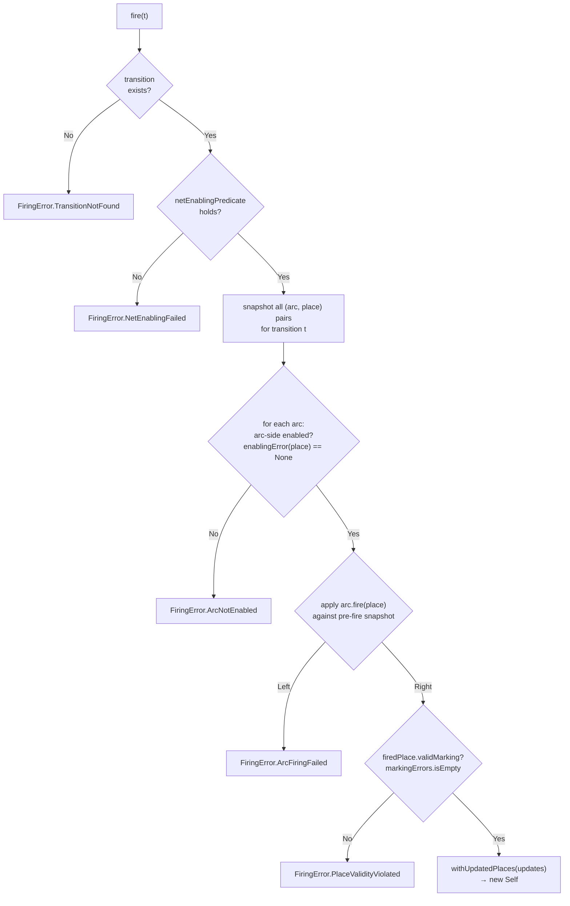
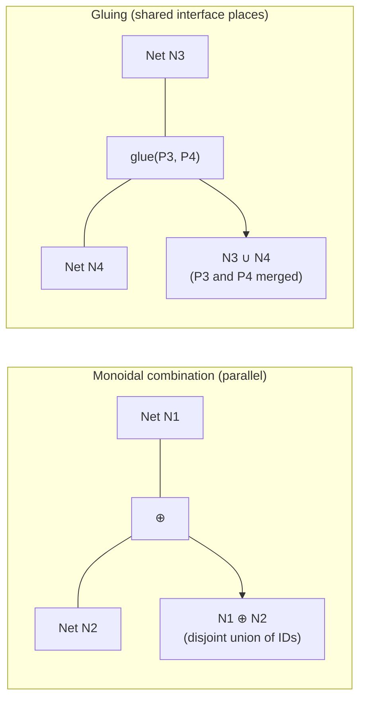

# Petri Net Library

A typed, extensible Petri net library for Scala 3, used internally to model the Hydrozoa protocol.
The library is designed around four separable concerns (topology, syntax, semantics, presentation)
and exposes a functional builder monad for constructing nets.

---

## Architecture Overview



- **Component layer** — trait hierarchies for individual places, arcs, and transitions
- **Net layer** — `Net` trait that composes the component traits; `MapNet` is the concrete map-backed implementation
- **SequentialSimulator** — firing algorithm mixed into `MapNet`
- **BuilderM** — `IndexedStateT`-based builder monad for constructing nets in for-comprehensions

---

## Ontological Ordering

Every component (and the net as a whole) is defined in four layers, each building on the previous:



| Layer        | Place concern                          | Arc concern                              | Transition concern          |
|--------------|----------------------------------------|------------------------------------------|-----------------------------|
| Topology     | Arc-connection restrictions (stub)     | `arcPlaceId`, `arcTransitionId`          | Arc-connection restrictions |
| Syntax       | `marking`, `mark(newMarking)`          | Weight, inscription                      | `silent`, `priority`        |
| Semantics    | `markingErrors`, `validMarking`        | `enablingError`, `fire`                  | Pre/postcondition (planned) |
| Presentation | `label`, `position`, `radius`          | `label`, `points`                        | `label`, `width`, `height`  |

---

## Component Layer

### Places



**`UnboundedPlace`** — no capacity limit; `markingErrors` always returns `Nil`.

**`BoundedPlace`** — has a `bound: PositiveInt`; constructed via a smart constructor that returns
`Either[TooManyTokens, BoundedPlace]`. `markingErrors` yields `TooManyTokens` if `marking > bound`.

> `Place.Syntax` uses F-bounded polymorphism (`Self <: Syntax[Self]`) so that `mark` returns
> the concrete type, not the trait. Every mixin trait that adds update methods follows the same
> pattern.

---

### Arcs



#### Arc type reference

| Arc type    | Direction   | Enabled when           | Effect on place              |
|-------------|-------------|------------------------|------------------------------|
| `PT`        | Place → Transition | `tokens >= weight`  | removes `weight` tokens      |
| `TP`        | Transition → Place | always              | adds `weight` tokens         |
| `Inhibitor` | Place → Transition | `tokens == 0`       | none (enabling only)         |
| `Reset`     | Place → Transition | always              | drains all tokens            |
| `Read`      | Place → Transition | `tokens >= weight`  | none (enabling only)         |

> `Inhibitor`, `Reset`, and `Read` do not consume or produce tokens; they only gate enabledness
> (Inhibitor, Read) or drain (Reset).

#### Petri net notation



Circles represent **places**; rectangles represent **transitions**. Arc labels show type and weight.
Inhibitor arcs are conventionally drawn with a circle arrowhead; Read arcs with a half-arrow.

---

### Transitions

`Transition` is currently a lightweight stub — semantics (pre/postconditions for data-aware nets)
are not yet implemented.

| Trait                        | Purpose                                              |
|------------------------------|------------------------------------------------------|
| `Transition.Topology`        | Stub; component-side arc restrictions deferred       |
| `Transition.Syntax.HasSilent`| Whether this transition appears in event logs        |
| `Transition.Syntax.HasPriority` | Relative priority for auto-firing selection       |
| `Transition.Semantics`       | Stub; guard expressions planned                      |
| `Transition.Presentation`    | `label`, `width`, `height`, `position`, `delay`      |

---

## Net Layer

### Trait hierarchy



**`MapNet`** stores places, transitions, and arcs in `TreeMap`s for deterministic iteration order.
All three type parameters (`ArcId`, `PlaceId`, `TransitionId`) require an `Ordering`.

### Topology validation mixins

| Mixin                  | What it checks                                          |
|------------------------|---------------------------------------------------------|
| `NoDanglingArcs`       | Every arc references a place and transition that exist  |
| `SingleArc`            | At most one arc per `(place, transition)` direction pair|

Both use the abstract-override list-accumulation pattern: `topologyErrors` chains via
`super.topologyErrors`, so multiple mixins compose cleanly.

> **Why `SingleArc`?** Firing endomorphisms do not commute in general (e.g. `PT(1)` then `Reset` ≠
> `Reset` then `PT(1)`). Restricting to one arc per direction makes firing trivially order-independent.

---

## Building a Net

`MapNet.BuilderMOps` provides a typed builder monad. Operations fail with a `BuilderError` on ID
conflicts or missing IDs; "force" variants (trailing `_`) silently overwrite instead.

```scala
// Fix the six net type parameters once
val ops = MapNet.BuilderMOps[String, String, String, MyArc, MyPlace, MyTransition]()
import ops.*

val program = for
    _ <- addPlace("p1", UnboundedPlace("input", marking = 2))
    _ <- addPlace("p2", UnboundedPlace("output"))
    _ <- addTransition("t1", myTransition)
    _ <- addArc("a1", PTArc("p1", "t1", weight = 1, label = "consume"))
    _ <- addArc("a2", TPArc("p2", "t1", weight = 1, label = "produce"))
yield ()

val result: Either[BuilderError, (MapNet[...], Unit)] = program.runEmpty
```

The `Monad` instance for `BuilderM` is provided as a `given`, so `traverse`, `sequence`, and other
Cats combinators are available when `import cats.implicits.*` is in scope.

---

## Enabling and Firing

### Enabling conditions compose under AND

Enabling is checked at four independent levels, all composed by conjunction:



Because conjunction is commutative and associative, the order of predicate evaluation is a
performance choice only — it does not affect correctness.

### SequentialSimulator firing algorithm

`SequentialSimulator.fire(t)` is purely functional: it returns `Either[FiringError, Self]` where
`Self` is the new net state with updated place markings.



Key points:
- All arc/place pairs are snapshotted **before** any endo is applied (pre-fire state).
- `Arc.Semantics.fire` does **not** check enabledness or place validity — those are the simulator's responsibility.
- `Place.Semantics.validMarking` is the place-side enabling condition (E1): it checks that the fired result satisfies the place's own invariants (e.g. `BoundedPlace` capacity).

---

## Validation Summary

| Check                     | Method                         | When to call                            |
|---------------------------|--------------------------------|-----------------------------------------|
| No dangling arcs          | `net.isValidTopology`          | After building, before simulating       |
| At most one arc per pair  | `net.isValidTopology`          | After building, before simulating       |
| All IDs have syntax       | `net.isValidSyntax`            | Guaranteed by construction in `MapNet`  |
| All IDs have semantics    | `net.isValidSemantics`         | Guaranteed by construction in `MapNet`  |
| Final marking reached     | `net.isValidTerminal`          | After simulation terminates             |

---

## Net Composition (Planned)

Two composition operators are planned but not yet implemented:



- **Monoidal combination** — disjoint union of two nets; each retains ownership of its own
  transitions and arcs. Requires disjoint ID sets.
- **Gluing** — identifies a subset of places from one net with places from another, creating shared
  interface places. After gluing, enabling and firing delegate to whichever sub-net owns the
  transition. Autofiring policy of the composed net is a separate semantic choice.
